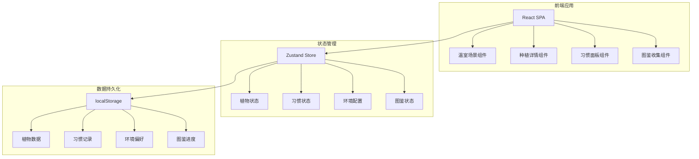
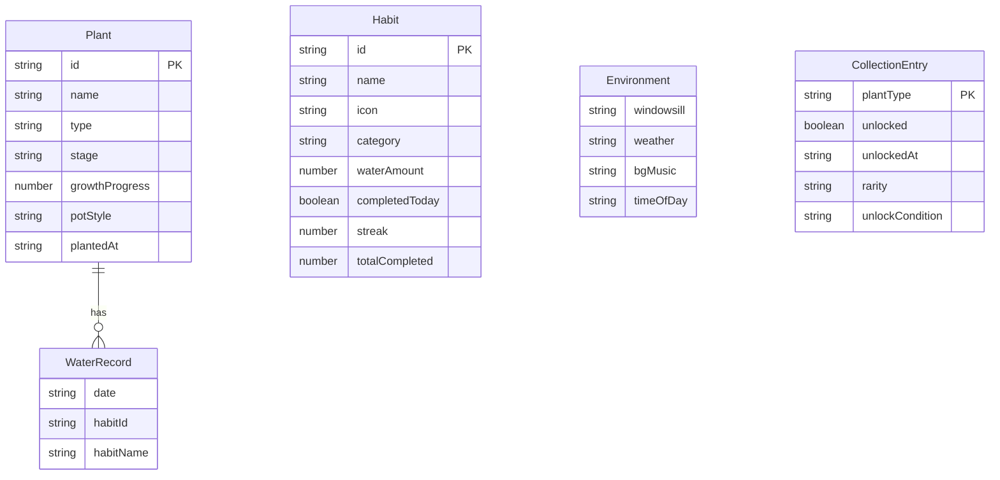

## 1. 架构设计



## 2. 技术说明
- **前端框架**：React@18 + TypeScript + Vite
- **样式方案**：TailwindCSS@3 + CSS Modules（像素风格特殊样式）
- **状态管理**：Zustand（轻量级，适合本地数据场景）
- **动画方案**：CSS Keyframes（植物生长动画）+ Framer Motion（页面过渡和微交互）
- **音效**：Howler.js（背景音乐和浇水音效）
- **初始化工具**：Vite
- **后端**：无（纯前端应用，数据存储在 localStorage）
- **数据库**：无（使用 localStorage 持久化）

## 3. 路由定义
| 路由 | 用途 |
|------|------|
| / | 温室主页面，展示所有植物和环境场景 |
| /plant/:id | 种植详情页，展示单株植物生长状态和习惯浇水 |
| /habits | 习惯面板页，今日习惯任务和打卡 |
| /collection | 图鉴收集页，所有植物图鉴和收集进度 |

## 4. API定义
无后端API，所有数据通过 Zustand Store + localStorage 在本地管理。

### 数据接口定义（TypeScript）

```typescript
interface Plant {
  id: string
  name: string
  type: PlantType
  stage: GrowthStage
  growthProgress: number
  potStyle: PotStyle
  plantedAt: string
  waterHistory: WaterRecord[]
}

type PlantType = "succulent" | "fern" | "flower" | "herb" | "cactus" | "tree" | "vine" | "mushroom" | "lotus" | "crystal"
type GrowthStage = "seed" | "sprout" | "seedling" | "growing" | "mature" | "blooming"
type PotStyle = "terracotta" | "ceramic" | "glass" | "wooden" | "stone"
type Rarity = "common" | "rare" | "epic" | "legendary"

interface WaterRecord {
  date: string
  habitId: string
  habitName: string
}

interface Habit {
  id: string
  name: string
  icon: string
  category: "health" | "mind" | "body"
  waterAmount: number
  completedToday: boolean
  streak: number
  totalCompleted: number
}

interface Environment {
  windowsill: "wooden" | "marble" | "brick" | "concrete"
  weather: "sunny" | "rainy" | "snowy" | "cloudy" | "starry"
  bgMusic: "rain" | "forest" | "piano" | "none"
  timeOfDay: "morning" | "afternoon" | "evening" | "night"
}

interface CollectionEntry {
  plantType: PlantType
  unlocked: boolean
  unlockedAt?: string
  rarity: Rarity
  unlockCondition: string
}
```

## 5. 服务端架构图
不适用（纯前端应用）

## 6. 数据模型

### 6.1 数据模型定义



### 6.2 数据定义语言
使用 localStorage 存储，数据结构如下：

```
Key: pixel-greenhouse-plants       Value: Plant[]
Key: pixel-greenhouse-habits       Value: Habit[]
Key: pixel-greenhouse-environment  Value: Environment
Key: pixel-greenhouse-collection   Value: CollectionEntry[]
Key: pixel-greenhouse-checkin      Value: { lastCheckin: string, streak: number }
```

初始数据：预置6种习惯（喝水、拉伸、阅读、深呼吸、散步、冥想）和10种植物类型图鉴条目。
